# 너와함께라면 (라면 추천 웹 서비스)

## 목차

### 1장. [개요](#개요)

#### 	1. 1. 서비스 기획

#### 	1. 2. 시스템 구상도

#### 	1. 3. 배포 목록

#### 	1. 4. Docker container

### 2장. [Front 사용 기술](#1장.-Front-사용-기술)

#### 	2. 1. [Next.js](#1.-Next.js)

#### 	2. 2. [TypeScript](#2.-TypeScript)

### 3장. [컨벤션](#2장.-컨벤션)

#### 	3. 1. [코드 컨벤션](#1.-코드-컨벤션)

#### 	3. 2. [깃 컨벤션](#2.-깃-컨벤션)

### 4장. [역할 분담 및 기능 설명](#3장.-역할-분담-및-기능-설명)

#### 	4. 1. [김지원](#김지원)

##### 		4. 1. 1. [메인페이지](#1.-메인페이지)

##### 		4. 1. 2. [키워드추천](#2.-키워드추천)

##### 		4. 1. 3. [NavBar](#3.-NavBar)

##### 		4. 1. 4. [검색결과](#4.-검색결과)

#### 	4. 2. [김동일](#김동일)

##### 		4. 2. 1. [라면 리스트페이지](#3.-2.-1.-라면-리스트페이지)

##### 		4. 2. 2. [라면 디테일 페이지](#3.-2.-2.-라면-디테일-페이지)

##### 		4. 2. 3. [마이페이지](#3.-2.-1.-마이페이지)

#### 	4. 3. [이윤우](#이윤우)

##### 		4. 3. 1. [사용자 정보 입력 페이지 (회원가입 1 단계)](#1.-사용자-정보-입력-페이지-(회원가입-1-단계))

##### 		4. 3. 2. [라면 취향 선택 페이지 (회원가입 2 단계)](#2.-라면-취향-선택-페이지-(회원가입-2-단계))

##### 		4. 3. 3. [선호 라면 선택 페이지 (회원가입 3 단계)](#3.-선호-라면-선택-페이지-(회원가입-3-단계))

##### 		4. 3. 4. [로그인](#4.-로그인)

##### 		4. 3. 5. [트위터 크롤링](#5.-트위터-크롤링)

##### 		4. 3. 6. [형태소 분석](#6.-형태소-분석)

### 5장. [백엔드](#백엔드)

#### 	5. 1. [Back 기술스택](#Back)

#### 	5. 2. [추천 시스템](#Back)

#### 	5. 3. [로그 시스템](#Back)

#### 	5. 4. [검색 시스템](#Back)

#### 	5. 5. [랭킹 시스템](#Back)

##### 	

## 특화프로젝트

### Notion

- 01: https://faceted-clover-f7a.notion.site/81169fccaa85421a80e69ac9dbadcb27
- 02: https://linen-jump-272.notion.site/e96ee3e33029457cb33d390388456191

### 팀원

* FE : 김동일, 김지원, 이윤우

* BE : 상진수(팀장), 최수한

  

## 1장. 개요

### 1. 서비스 기획

* 저희는 삼성 청년 SW 아카데미(SSAFY) 특화프로젝트 : 빅데이터 - 추천 도메인으로 라면 추천 서비스를 기획하였습니다.

  국내에는 다양한 라면 종류가 있는 반면, 제한적인 라면만 소비가 됩니다. 또한 새로운 라면이 출시되지만 평이나 자신의 취향에 맞는지 몰라 선택에 어려움을 느낀 경험이 있으실 겁니다.

  저희는 로그 기반 행동 패턴 분석 및 라면의 데이터를 통해 다양한 방식의 활용한 라면 추천 서비스를 기획 하였습니다.

### 2. 시스템 구상도

### 3. 배포 목록

* 배포 사이트
  * http://j6c104.p.ssafy.io
* 사용자 로그 Kibana
  * http://j6c104.p.ssafy.io:5601
* 검색 서버 Kibana
  * http://j6c104.p.ssafy.io:5602
* Admin
  * http://j6c104.p.ssafy.io:9999/admin
* Swagger
  * http://j6c104.p.ssafy.io:8080/swagger-ui/index.html#/ramen-controller : main
  * http://j6c104.p.ssafy.io:8081/swagger-ui/index.html#/ramen-controller : ranking
  * http://j6c104.p.ssafy.io:8083/api : auth

### 4. Docker container

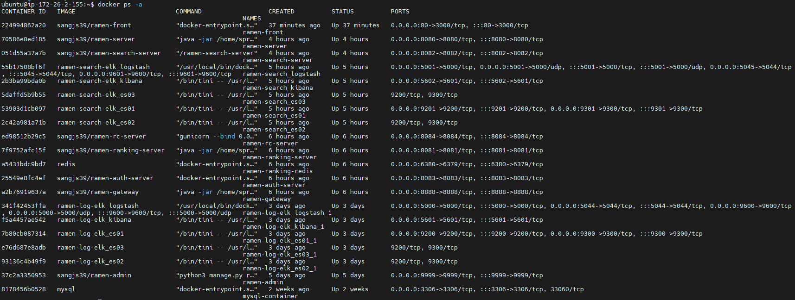

* container 20개로 서비스 구현

## 2장. Front 사용 기술

### 2. Next.js

#### Next.js 란?

- Next.js 란 __React 라이브러리의 프레임워크__입니다. 
- 라이브러리와 프레임 워크의 주요 차이점: __통제의 역전__
  - 라이브러리에서는 메서드를 호출하면 사용자가 제어할 수 있습니다.
  - 그러나, 프레임워크에서는 제어가 역전되어 프레임워크가 사용자를 호출합니다.
- React.js는 라이브러리, Next.js는 프레임 워크

#### Next.js 사용 이유

- __SEO(Search Engine Optimization)__를 위한 __Server-Side Rendering(SSR)__을 가능하게 하기 때문에!!

  - SEO(검색 엔진 최적화)는 웹사이트가 유기적인(무료) 검색 방식을 통해 검색 엔진에서 상위에 노출될 수 있도록 최적화하는 과정

  - 많은 사용자를 만들기 위해선 SEO가 필수적이라 판단하였고 이에 최적화된 Next.js 를 사용하기로 판단

  - Server-Side Rendering(SSR) vs Client Side Rendering(CSR)

    | 구분 | Client Side Rendering(CSR)                                   | Server Side Rendering(SSR)                                   |
    | ---- | ------------------------------------------------------------ | ------------------------------------------------------------ |
    | 장점 | 1. 사용자의 행동에 따라 필요한 부분만 다시 읽어들이기 때문에 SSR 보다 조금 더 빠른 인터랙션 가능  2. page 전체를 요청하지 않고 페이지에 필요한 부분만 변경하기 때문에, 모바일 네트워크에서도 빠른 속도로 렌더링이 가능  3. lazy loading 지원  4. 서버사이드 렌더링이 따로 필요하지 않기 때문에 일관성 있는 코드를 작성할 수 있음 | 1. 사용자가 처음으로 컨텐츠를 볼 수 있는 시점을 앞당길 수 있음  2. __검색엔진최적화__(SEO) 적용이 용이 |
    | 단점 | 1.  Googlebot과 Searchconsole에 검색 노출이 되지 않음  2. 페이지를 읽고, 자바스크립트를 읽은 후 화면을 그리는 시간까지 모두 마쳐야 콘텐츠가 사용자에게 보여지기 때문에 초기구동 속도가 느림 | 1. 모든 요청에 관해 필요한 부분만 수정하는 것이 아닌, 완전히 새 페이지를 로딩하고 렌더해줌(새로고침)  2. 전체를 로딩하다보니 CSR보다 느리고, bandwitdh를 많이 쓰고, 사용자 경험 좋지 않음 |

### 2. TypeScript

#### TypeScript 란?

- 타입스크립트는 __자바스크립트에 타입을 부여__한 언어입니다.

#### TypeScript 사용 이유

- __에러의 사전 방지__와 __코드 가이드 및 자동 완성(개발 생산성 향상)__

  - 타입스크립트는 코드에 목적을 명시하고 목적에 맞지 않는 변수나 함수들에서 에러를 발생시켜 버그를 사전에 제거합니다.

  - 또한 코드 자동완성이나 실행 전 피드백을 제공하여 작업과 동시에 디버깅이 가능해 생산성을 높일 수 있습니다.

## 3장. 컨벤션

### 1. 코드 컨벤션

- 컴포넌트: 단어 첫 글자 대문자 (ex. NavBar, GenderButton ...)

  

- 페이지: 폴더 + 소문자

  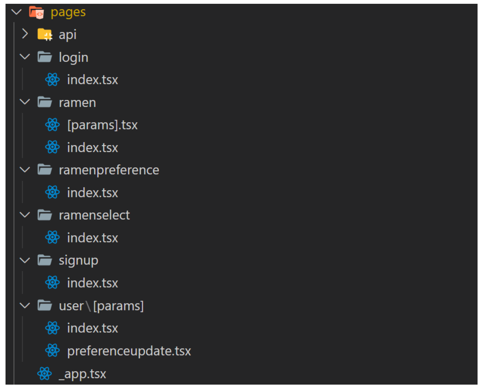

### 2. 깃 컨벤션

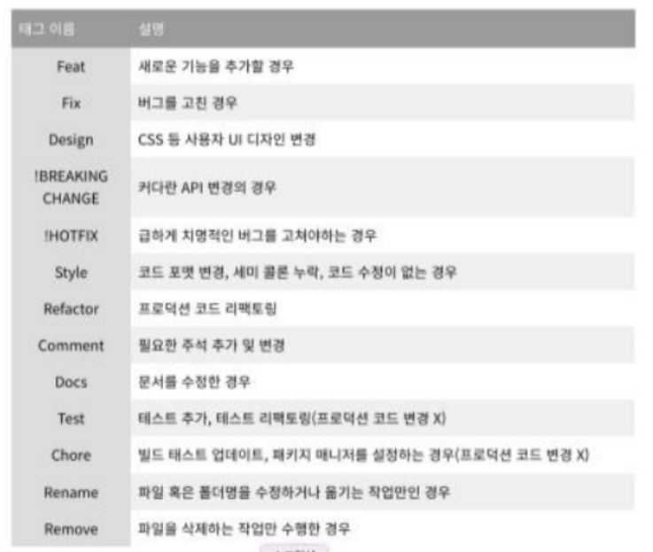

## 4장. 역할 분담 및 기능 설명

#### 김지원

##### 1. 메인페이지

- 아이콘 클릭을 통한 라면 종류별, 면 타입별, 국물 유무에 따른 라면검색 페이지 제작

  - React의 useState훅을 사용한 데이터 추가방식으로 제작

  - 기본적인 Grid시스템이나 Modal등 UI컴포넌트는 부트스트랩, Mui를 이용 CSS이벤트 및 반응형 이미지는 직접 제작해서 일부 사용

  - 그리고 최종적으로 state값에 저장된 쿼리값을 Next.js의 useRouter를 활용해 검색결과 목록으로 전송

    

- 백엔드 API를 활용한 랭킹, 추천목록 제작

  - API에서 get과 post요청으로 인한 값을 리스트화해 로그인조건, 그리고 데이터의 응답 요청 조건에 따른 페이지를 React 삼항연산자 구문을 통해 구현

  - 비로그인 시

    

    

  - 로그인 시

    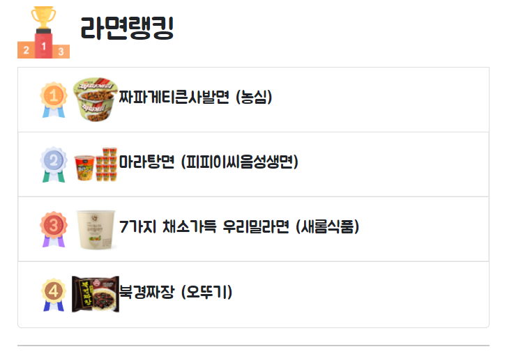

    

    

    

 

##### 2. 키워드추천

- 크롤링된 블로그, 트위터 키워드를 바탕으로 뽑아낸 단어별 태그값으로 검색하는 페이지제작, CSS animation활용

  

- state값에 저장된 쿼리값을 Next.js의 useRouter를 활용해 결과 목록으로 전송

##### 3. NavBar

- 프론트 전 페이지에서 사용되는 NavBar제작

  - 반응형으로 제작해 사이즈에 따라 모바일용, 데스크탑용으로 상하단 반응형 NavBar로 제작

  - Bootstrap기반의 Navbar에 커스텀 html,css를 이용해 반응형 모바일 NavBar 따로 제작 검색창에 텍스트 결과는 Next.js의 useRouter를 사용해 검색 결과로 전송

  - 데스크탑

    

  

  - 모바일

    

    

##### 4. 검색결과

- 텍스트 검색결과

  - NavBar검색창에서 넘어온 텍스트를 기반으로 API 요청후 db에 존재하는 결과값을 받아 라면 리스트 출력후 상세페이지로 연결

    

- 카테고리 검색결과

  - 메인페이지 아이콘 검색창에서 넘어온 쿼리값을 기반으로 API요청후 분류된 라면 리스트 출력후 상세페이지로 연결

  - 봉지 + 유탕면 + 비빔 라면

    

- 키워드 검색결과

  - 키워드를 바탕으로 뽑아낸 단어 태그값과 연결되는 라면데이터를 API요청후 나온 결과값을 출력, 각 결과를 상세페이지로 연결

    

#### 김동일

##### 1.라면 리스트페이지

- Tab(All, Bongji, Cup) + Pagination을 이용한 전체 라면을 볼 수 있는 리스트 페이지 제작

  - Tab, pagination UI컴포넌트는 MUI를 이용하여 반응형 웹페이지 제작

- getServerSideProps를 이용하여 라면의 List정보들을 가져와 제작, 검색 엔진 최적화 및 빠른 페이지 렌더링

- TypeScipt를 이용한 생산성 향상

  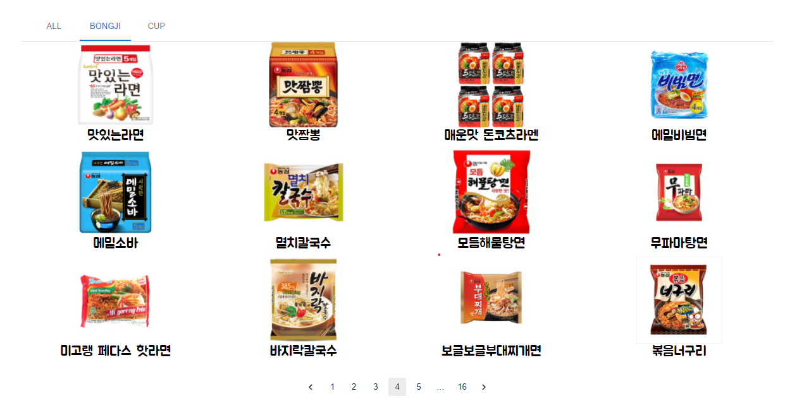

##### 2. 라면 디테일 페이지

- 3대 성분인 탄수화물, 단백질, 지방을 Pie Chart를 이용하여 탄, 단, 지 성분이 현재라면의 어느정도 비중을 차지하는지 표현

- 라면의 성분(칼로리, 탄수화물, 단백질, 지방, 당류, 나트륨)을 Table, Bar Chart를 이용하여 현재라면, 가지고 있는 데이터 상의 라면들의 평균, 보건복지부가 제공하는 1일 권장 섭취량과 비교하여 사용자에게 보여준다

  - 비로그인 사용자는 표준 한국인 권장 섭취량
  - 로그인 사용자는 나이, 성별에 따른 권장 섭취량
  - Table UI컴포넌트는 MUI를 이용

  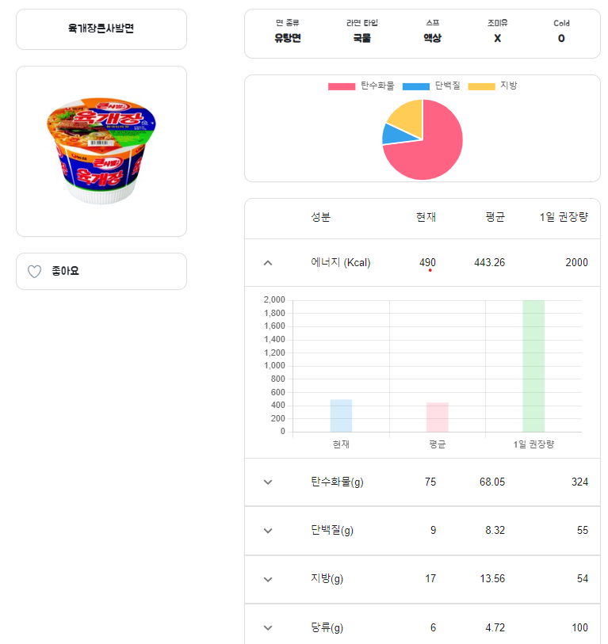

- 비슷한 라면 3개를 Bar Chart를 이용하여 현재라면과 비슷한라면의 짠맛점수, 단맛 점수를 비교하여 보여준다

  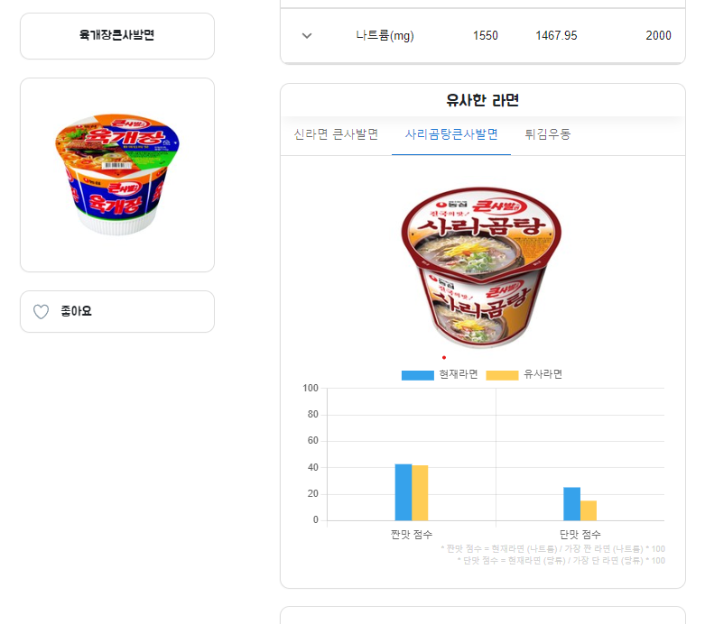

- 현재라면의 먹방 Youtube영상을 화면 크기에 맞게 반응형으로 띄어준다.

- 로그인한 사용자가 현재 라면을 좋아요했는지 확인해주고, 좋아요를 수정할 수 있도록 해준다

  - [좋아요](https://codepen.io/Zaku/pen/gOrjOGp)는 svg를 이용해 사용자에게 이벤트 효과를 적용

- 비로그인 사용자는 좋아요 클릭시 로그인 페이지로 이동

- media query이용한 반응형 제작

  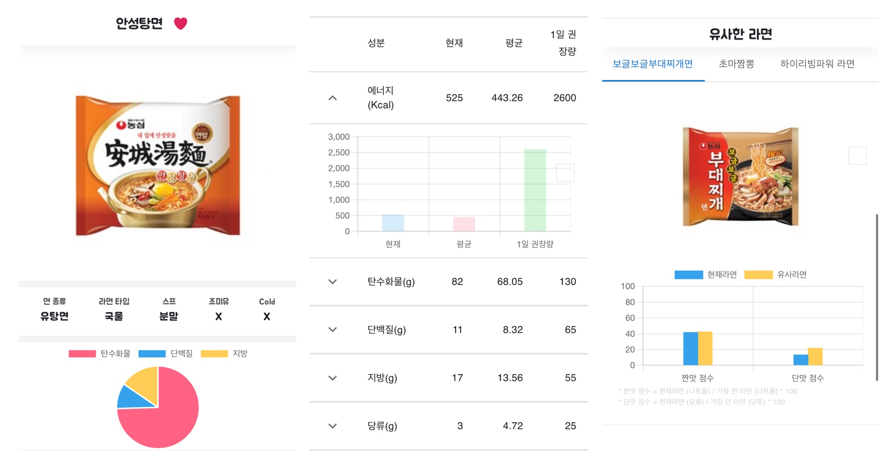

- getServerSideProps를 이용하여 라면의 Detail정보들을 가져와 제작, 검색 엔진 최적화 및 빠른 페이지 렌더링

- TypeScipt를 이용한 생산성 향상

##### 3. 마이페이지

- 사용자의 이름, 나이, 성별, 취향, 좋아요 목록을 확인

- 취향 수정가능

  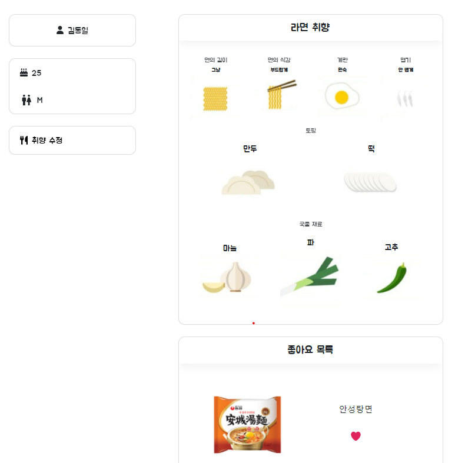

- 좋아요 목록은 Pagination으로 구현 및 클릭시 좋아요 취소 및 Ramen Detail 페이지로 이동

  - Pagination UI는 MUI 이용

  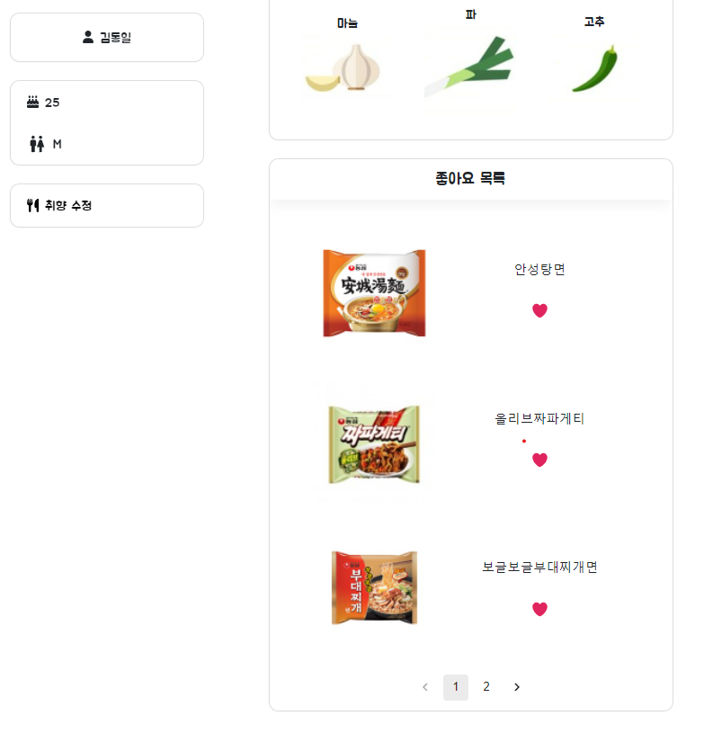

- media query이용한 반응형 제작

  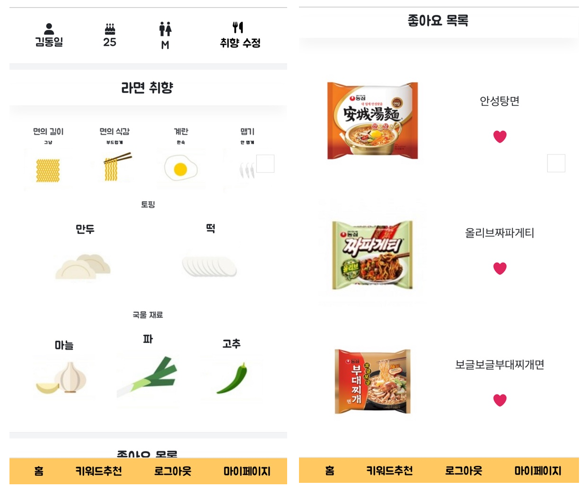

- TypeScipt를 이용한 생산성 향상

##### 4. [네이버 크롤링]('https://github.com/K-Dongil/NaverBlogCrawling')

- 네이버 검색 API를 이용하여 라면들의 후기를 가져올 수 있는 키워드를 입력 후 블로그 주소 결과값들을 받아온다.
- meta 태그의 속성값이 follow인지 확인하여 크롤링을 할 수 있는 블로그인지 판단 후 블로그의 내용을 가져온다. (라면의 특징들을 분석할 수 있는 라면후기 데이터를 수집)
- 약 (200 * 466) 개의 블로그 데이터 수집

#### 이윤우

##### 1. 사용자 정보 입력 페이지 (회원가입 1 단계)

- email, 이름, 비밀번호, 비밀번호 확인, 이름, 나이, 성별 입력 페이지 제작

  

  

- 정규표현식을 사용한 이메일 형식 체크

  

  

- 백엔드 API를 활용한 이메일 중복 체크

  

  

  

##### 2. 라면 취향 선택 페이지 (회원가입 2 단계)

- 페이지 입장 시 Modal을 통한 이용 가이드 안내

  

- 아이콘 클릭을 통한 선호하는 라면 취향 (면의 길이, 면의 식감, 계란, 맵기, 토핑, 국물 재료) 선택 페이지 제작 

  - React의 useState훅과 useEffect 훅을 사용하여 기능 구현 

  - 기본적인 Grid시스템이나 Modal등 UI컴포넌트는 Bootstrap, MUI를 이용하여 반응형 웹페이지 제작

  - 사용자의 선택에 적절한 피드백을 주기 위한 CSS 이벤트 구현

  - 취향 선택 전

    

  - 취향 선택시

    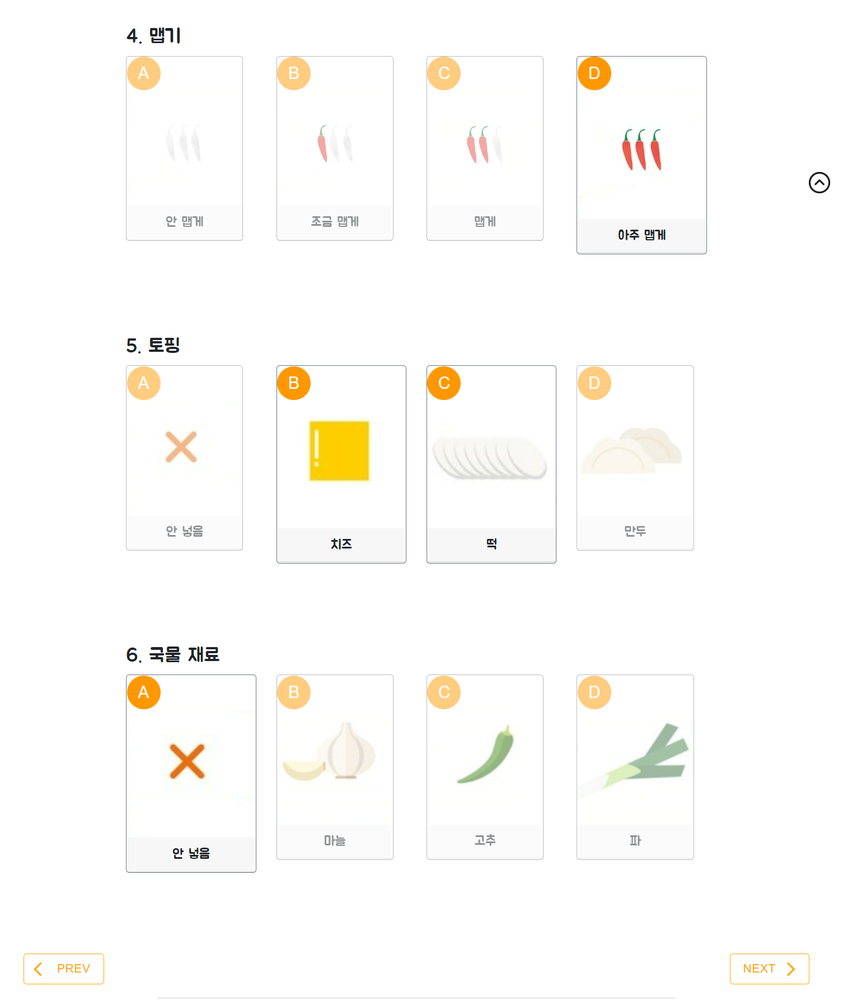

##### 3. 선호 라면 선택 페이지 (회원가입 3 단계)

- 아이콘 클릭을 통한 선호 라면 (면의 길이, 면의 식감, 계란, 맵기, 토핑, 국물 재료) 선택 페이지 제작

  - 기본 라면 16개 + 유사 라면 48개 = 총 64 개의 라면 제공

  - 기본 라면 클릭 시 숨겨져 있던 해당 라면과 유사한 라면 3개가 보여짐

  - 사용자의 초기 정보를 받기 위한 과정이기 때문에 최소 1개 이상의 라면을 "좋아요" 해야 회원 가입 가능

  - 아무 라면도 좋아요를 하지 않은 상태의 화면

    

  - __기본 라면__인 '사리곰탕큰사발면' 클릭 시, 숨겨져 있던 사리곰탕큰사발면과 유사한 라면 '자연드림사골라면', '튀김우동', '우육탕면' 이 화면에 렌더링

    

##### 4. 로그인

- 쿠키를 사용한 로그인 상태 유지

- AccessToken, RefreshToken 을 사용한 보안 인증

- HOC(고차 컴포넌트)를 이용한 로그인 페이지 redirect

  - 로그인 상태에서 "로그인 페이지" 접근 시, 메인 화면으로 redirect

    

    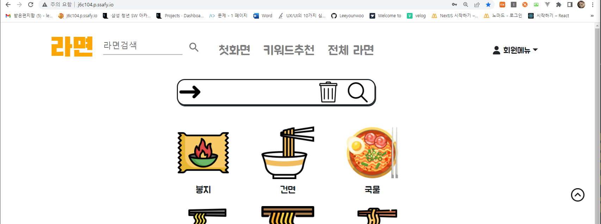

  - 비로그인 상태에서 "좋아요" 클릭시 로그인 페이지로 이동

    

    

##### 5. 트위터 크롤링

- Twint 라이브러리를 사용해서 466개 라면의 2016년 1월 1일부터 2021년 12월 31일까지의 데이터 크롤링

- 총 463,458 개의 트윗 데이터 수집

  

##### 6. 형태소 분석

- 맛 형용사 사전 구축 후 해당 맛 언급 횟수 count

## 5장. 백엔드

### 1. Back 기술 스택

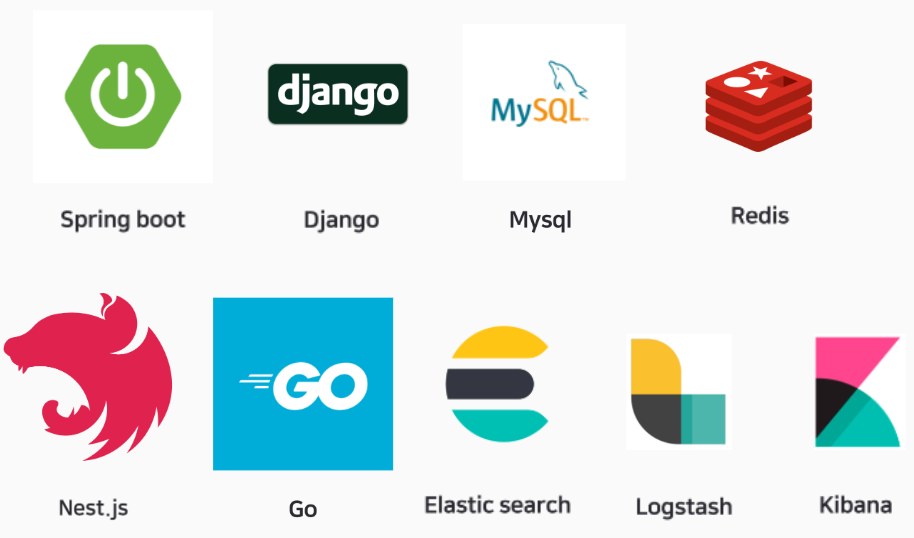

* Spring boot(main, ranking), Spring Cloud Gateway, JPA
* Dajngo(recommend, admin), pandas, tensorflow2
* Nest.js(auth)
* Go(search)
* Mysql(main), Redis(ranking)
* Elasticsearch, logstash, kibana, logback (log)

### 2. 추천 시스템

1. 하이브리드 추천 알고리즘

   - 사용자 기반 협업 필터링 + 취향 기반 추천 알고리즘 + 사용자 실시간 로그 데이터
   - 아이템 기반 협업 필터링 + 취향 기반 추천 알고리즘 + 사용자 실시간 로그 데이터

2. 딥러닝 기반 추천 알고리즘

   - 사용자 라면 좋아요 데이터를 학습하여 라면 추천

     

### 3. 로그 시스템

1. Logback 을 통해 Logstash 가 로그 수집

2. Elasticsearch 통해 member 별 log 적재

3. Recommend 서버 통해 로그 기반 행동 패턴 분석 및 라면 유사도 계산

4. Kibana로 검색 횟수, 검색 시간대 등 로그 분석 시각화

   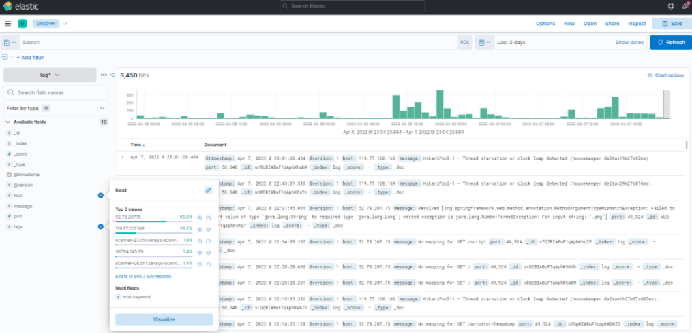

### 4. 검색 시스템

1. Logstash pipeline 통해 MySQL 로부터 DB 동기화
2. Elasticsearch - Go 구성 통해 빠른 검색 기능 구현
3. Kibana로 검색 횟수, 검색 시간대 등 로그 분석 시각화

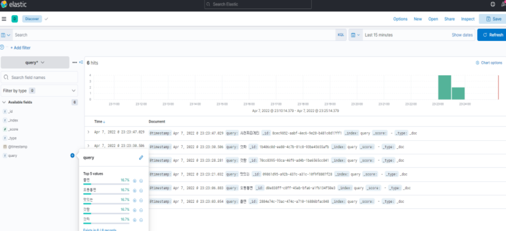

### 5. 랭킹 시스템

1. 클라이언트로 부터 로그인 한 경우 안한 경우를 나눔

2. 로그인 한 경우는 memberId 적재, 안한 경우는 client IP를 Redis에 적재하여 구분

3. 순위 조작을 할 수 없게 하루에 한번만 적재가 가능하도록 구현

4. batch 스케쥴러를 활용해 하루에 한번 오전 7시에 초기화

   
